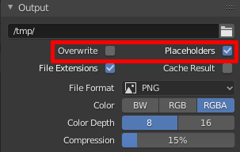

# What is this
todo

# How to use this?
## Setup
### Before starting
1. Syntax for the IP file is just one line, all the IPs separated by one space.
1. It is **required** to have a central location for both the input blend file and the ouput frames. For example I use a SMB share mounted on `/mnt/projects` on all nodes.
1. A working SSH server on the nodes and a working client on the master computer.
1. Requirements for Arch Linux: `blender (wget https://ftp.nluug.nl/pub/graphics/blender/release/Blender2.81a/blender-2.81a-linux-glibc217-x86_64.tar.bz2 && tar jxf blender-2.81a-linux-glibc217-x86_64.tar.bz2 && mv blender-2.81a-linux-glibc217-x86_64 blender-2.81a && rm blender-2.81a-linux-glibc217-x86_64.tar.bz2) screen `
1. I also highly recommend setting up public key authentication between the computer you will be running the script on and the render nodes
1. Save the blend file with these options!  
  
  
Once all the nodes have the central location configured in `/etc/fstab`, you can mount all of them like this:  
`python __main__.py setup FILE_WITH_IP_ADDRESSES MOUNT_PATH`
  
All this command does is that it issues `mount MOUNT_PATH` on all nodes listed in the IP addresses file.

## Rendering
Once you are finished with mounting, you are ready to start rendering:  
`python __main__.py start PATH_TO_BLENDER FILE_WITH_IP_ADDRESSES BLEND_FILE_TO_RENDER OUTPUT_FRAME_NAME_AND_PATH_FOR_RENDERING`
### Example
`python Documents/vscode/rugl/python3/blender_distributor/__main__.py start /home/satcom886/apps/blender-2.81a/blender ip_addresses /mnt/projects/test/untitled.blend /mnt/projects/test/results/frame_`